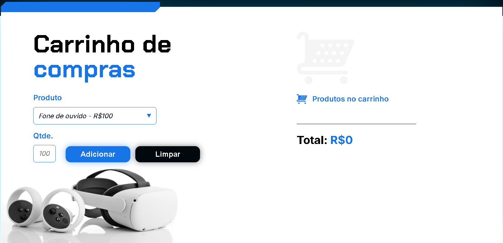

# 🛒 Carrinho de Compras Interativo

Projeto de carrinho de compras simples, desenvolvido com HTML, CSS e JavaScript puro.

## 📌 Funcionalidades

- Seleção de produtos com preço já definido.
- Campo para inserção da quantidade desejada.
- Botão para adicionar produto ao carrinho.
- Cálculo automático do valor total.
- Botão para limpar o carrinho.

## 🖥️ Tecnologias Utilizadas

- HTML5
- CSS3 (com responsividade e estilização moderna)
- JavaScript (manipulação de DOM e lógica de negócio)

## 📷 Interface

 

## 🔧 Como usar

1. Clone o repositório:
   ```bash
   git clone https://github.com/seuusuario/nome-do-repositorio.git
2. Abra `index.html` em seu navegador.
3. Selecione um **item** e uma **quantidade**
4. Clique no botão **adicionar**
5. Use **limpar** para reiniciar
   
## 👨‍💻 Desenvolvedor

**Murilo Fukushima Rodrigues**  
🔗 [GitHub](https://github.com/Murilofuku)  
🔗 [LinkedIn](https://www.linkedin.com/in/murilo-fukushima-rodrigues-729108302/)
